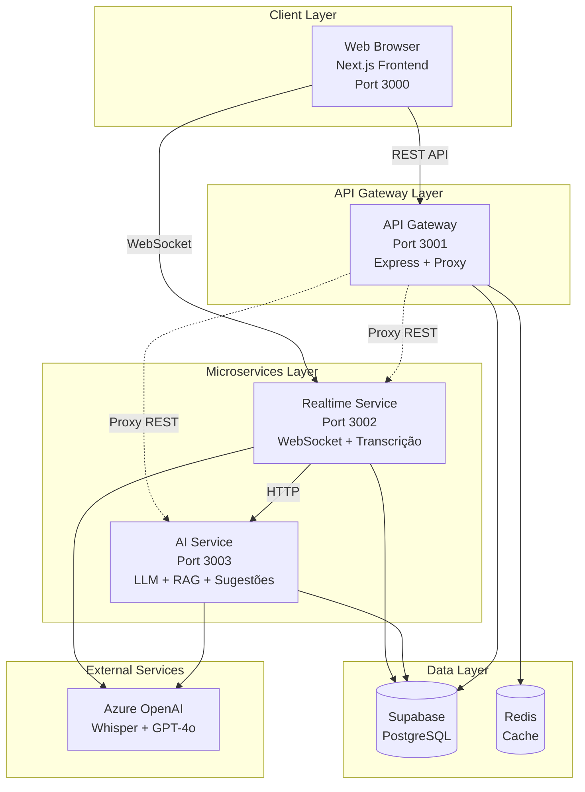
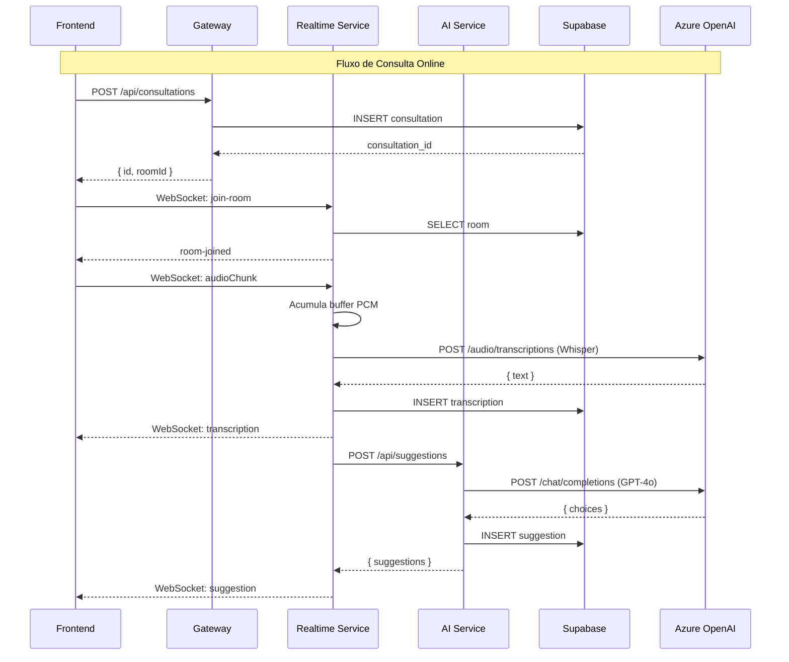
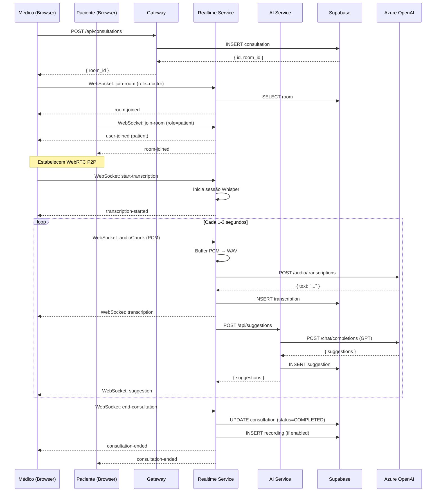
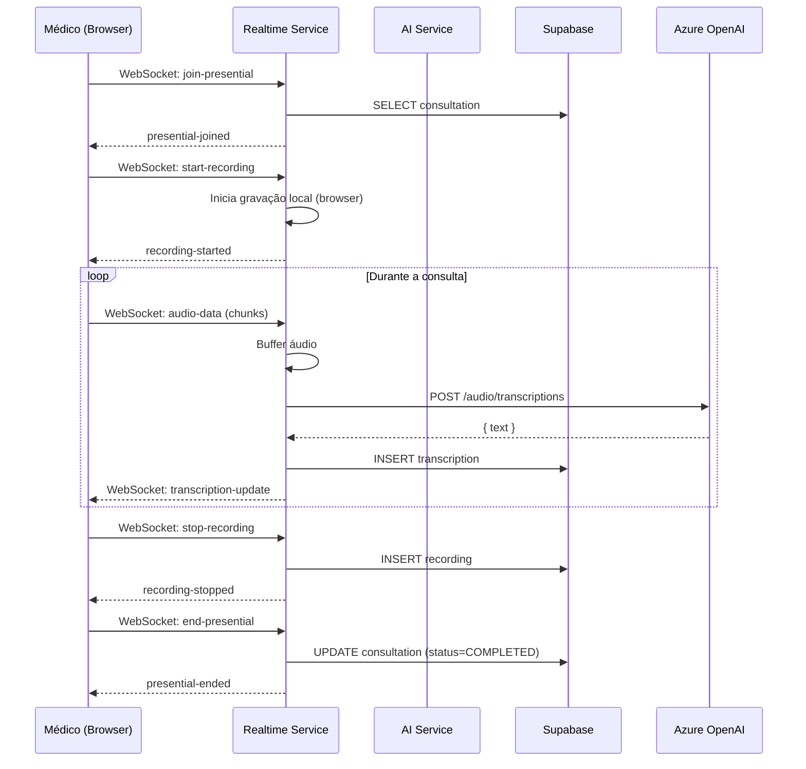
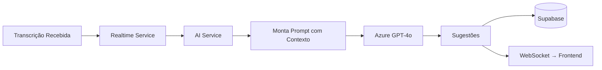

# 🏗️ ARQUITETURA DE MICROSERVIÇOS - MedCall AI

> **Documento Técnico Completo**: Arquitetura, Implementação e Migração de Monolito para Microserviços

---

## 📑 Sumário

1. [Visão Geral da Arquitetura](#1-visão-geral-da-arquitetura)
2. [Estrutura de Diretórios](#2-estrutura-de-diretórios)
3. [Backend: Microserviços](#3-backend-microserviços)
4. [Frontend: Next.js](#4-frontend-nextjs)
5. [Comunicação Entre Serviços](#5-comunicação-entre-serviços)
6. [Pacotes Compartilhados](#6-pacotes-compartilhados)
7. [Banco de Dados](#7-banco-de-dados)
8. [Deploy e Infraestrutura](#8-deploy-e-infraestrutura)
9. [Fluxos de Dados Críticos](#9-fluxos-de-dados-críticos)
10. [Guia de Migração Monolito → Microserviços](#10-guia-de-migração-monolito--microserviços)

---

## 1. Visão Geral da Arquitetura

O **MedCall AI** implementa uma arquitetura de microserviços com 3 serviços backend independentes, 1 frontend Next.js, e serviços externos (Supabase, Azure OpenAI, Redis).

### 1.1 Diagrama de Alto Nível



### 1.2 Princípios Arquiteturais

| Princípio | Implementação |
|-----------|---------------|
| **Separação de Responsabilidades** | Cada microserviço tem um domínio específico (Gateway, Realtime, AI) |
| **Independência de Deploy** | Cada serviço pode ser deployado separadamente |
| **Comunicação via API** | REST APIs + WebSocket para comunicação síncrona/assíncrona |
| **Shared-Nothing** | Cada serve tem seu próprio código, mas compartilha DB e tipos |
| **Escalabilidade Horizontal** | Serviços stateless podem escalar independentemente |
| **Monorepo** | npm workspaces para gerenciar todos os serviços em um repositório |

---

## 2. Estrutura de Diretórios

### 2.1 Estrutura Completa

```
medcall-ai/
├── apps/                          # Aplicações principais
│   ├── frontend/                  # Frontend Next.js
│   │   ├── src/
│   │   │   ├── app/              # App Router (Next.js 14)
│   │   │   ├── components/       # Componentes React
│   │   │   ├── lib/              # Bibliotecas cliente (supabase, email, etc)
│   │   │   ├── hooks/            # React hooks customizados
│   │   │   ├── store/            # Zustand stores
│   │   │   └── types/            # TypeScript types
│   │   ├── public/               # Assets estáticos
│   │   ├── middleware.ts         # Next.js middleware (auth)
│   │   ├── next.config.js
│   │   └── package.json
│   │
│   └── backend/                   # Backend microserviços
│       ├── gateway/               # API Gateway (Port 3001)
│       │   ├── src/
│       │   │   ├── routes/       # Rotas REST locais + proxy
│       │   │   ├── middleware/   # CORS, rate limit, auth
│       │   │   ├── services/     # Lógica de negócio
│       │   │   ├── controllers/  # Controladores
│       │   │   ├── models/       # Modelos de dados
│       │   │   ├── config/       # Configurações
│       │   │   ├── types/        # TypeScript types
│       │   │   ├── utils/        # Utilidades
│       │   │   ├── websocket/    # WebSocket handlers (legado)
│       │   │   ├── server.ts     # Servidor Express
│       │   │   └── index.ts      # Entry point
│       │   └── package.json
│       │
│       ├── realtime-service/      # Serviço de Realtime (Port 3002)
│       │   ├── src/
│       │   │   ├── routes/       # REST: sessions, rooms, recordings, transcription
│       │   │   ├── websocket/    # Socket.IO handlers
│       │   │   │   ├── rooms.ts              # Salas WebRTC
│       │   │   │   ├── presencial.ts         # Consultas presenciais
│       │   │   │   ├── audioHandler.ts       # Processamento de áudio
│       │   │   │   ├── transcriptionHandler.ts  # Transcrição Whisper
│       │   │   │   └── pcmTranscriptionHandler.ts  # WebSocket PCM
│       │   │   ├── services/     # Serviços (transcrição, OpenAI, etc)
│       │   │   ├── middleware/   # CORS, rate limit
│       │   │   ├── config/       # Configurações
│       │   │   ├── types/        # TypeScript types
│       │   │   ├── utils/        # Utilidades
│       │   │   ├── server.ts     # Servidor Express + Socket.IO
│       │   │   └── index.ts      # Entry point
│       │   └── package.json
│       │
│       └── ai-service/            # Serviço de IA (Port 3003)
│           ├── src/
│           │   ├── routes/       # REST: suggestions, ai-pricing
│           │   ├── services/     # LLM, RAG, embeddings
│           │   ├── middleware/   # CORS, rate limit
│           │   ├── config/       # Configurações
│           │   ├── prompts/      # Prompts GPT
│           │   ├── server.ts     # Servidor Express
│           │   └── index.ts      # Entry point
│           └── package.json
│
├── packages/                      # Pacotes compartilhados
│   ├── shared-types/             # TypeScript types compartilhados
│   ├── ui-components/            # Componentes UI reutilizáveis
│   └── utils/                    # Funções utilitárias
│
├── database/                      # Database
│   ├── migrations/               # SQL migrations
│   ├── schemas/                  # Schema definitions
│   └── seeds/                    # Dados de exemplo
│
├── configs/                       # Configurações
│   ├── docker/                   # Dockerfiles
│   │   ├── frontend.Dockerfile
│   │   ├── gateway.Dockerfile
│   │   ├── realtime-service.Dockerfile
│   │   └── ai-service.Dockerfile
│   ├── k8s/                      # Kubernetes manifests
│   └── nginx.conf                # NGINX config
│
├── docs/                         # Documentação
├── scripts/                      # Scripts auxiliares
├── docker-compose.yml            # Docker Compose
├── lerna.json                    # Lerna config (alternativa)
├── package.json                  # Root package (workspaces)
└── README.md
```

### 2.2 npm Workspaces

O projeto usa **npm workspaces** para gerenciar o monorepo:

```json
{
  "workspaces": [
    "apps/*",
    "apps/backend/*",
    "packages/*"
  ]
}
```

**Benefícios**:
- Instalar todas as dependências com um único `npm install`
- Compartilhar `node_modules` entre workspaces
- Scripts centralizados no package.json raiz
- Facilita desenvolvimento local

---

## 3. Backend: Microserviços

O backend é dividido em 3 microserviços independentes, cada um com sua própria responsabilidade.

### 3.1 Gateway (Port 3001)

#### Responsabilidades
- **API Gateway**: Ponto de entrada único para requisições HTTP
- **Proxy Reverso**: Redireciona requisições para realtime-service e ai-service
- **Segurança**: CORS, Helmet, Rate Limiting, JWT Authentication
- **Rotas Locais**: Auditoria, clínicas, webhooks, Twilio

#### Tecnologias
```json
{
  "framework": "Express.js",
  "proxy": "http-proxy-middleware",
  "security": ["helmet", "cors", "express-rate-limit"],
  "auth": "jsonwebtoken",
  "database": "@supabase/supabase-js",
  "cache": "ioredis",
  "validation": "zod"
}
```

#### Rotas Locais (não proxied)
```
/api/health           → Health check do gateway
/api/audit/*          → Logs de auditoria
/api/clinic/*         → Gestão de clínicas
/api/twilio/*         → Integração Twilio (SMS)
```

#### Rotas Proxied para Microserviços

**Para Realtime Service** (Port 3002):
```
/api/transcription/*  → Serviço de transcrição
/api/sessions/*       → Sessões de consulta
/api/rooms/*          → Salas WebRTC
/api/recordings/*     → Gravações
```

**Para AI Service** (Port 3003):
```
/api/ai-pricing/*     → Custos de IA
/api/suggestions/*    → Sugestões inteligentes
```

#### Código de Proxy

```typescript
// apps/backend/gateway/src/routes/proxy.ts
import { createProxyMiddleware } from 'http-proxy-middleware';

const REALTIME_SERVICE_URL = process.env.REALTIME_SERVICE_URL || 'http://localhost:3002';
const AI_SERVICE_URL = process.env.AI_SERVICE_URL || 'http://localhost:3003';

// Proxy para Realtime Service
router.use('/transcription', createServiceProxy(REALTIME_SERVICE_URL, '/transcription'));
router.use('/sessions', createServiceProxy(REALTIME_SERVICE_URL, '/sessions'));
router.use('/rooms', createServiceProxy(REALTIME_SERVICE_URL, '/rooms'));
router.use('/recordings', createServiceProxy(REALTIME_SERVICE_URL, '/recordings'));

// Proxy para AI Service
router.use('/ai-pricing', createServiceProxy(AI_SERVICE_URL, '/ai-pricing'));
router.use('/suggestions', createServiceProxy(AI_SERVICE_URL, '/suggestions'));
```

#### Middlewares de Segurança

```typescript
// apps/backend/gateway/src/server.ts
app.use(helmet({ /* CSP e headers de segurança */ }));
app.use(corsMiddleware); // CORS configurável
app.use(generalRateLimiter); // Rate limiting geral
app.use(express.json({ limit: '50mb' }));
app.use('/api', proxyRoutes); // Proxy para microserviços
```

---

### 3.2 Realtime Service (Port 3002)

#### Responsabilidades
- **WebSocket (Socket.IO)**: Comunicação em tempo real
- **Transcrição de Áudio**: Azure Whisper API
- **Gestão de Salas WebRTC**: Online e presencial
- **Gravação de Consultas**: Armazenamento de áudio/vídeo
- **Sessões de Consulta**: CRUD de sessões

#### Tecnologias
```json
{
  "framework": "Express.js + Socket.IO",
  "websocket": "Socket.IO 4.8",
  "audio": ["fluent-ffmpeg", "@ffmpeg-installer/ffmpeg"],
  "transcription": "Azure OpenAI Whisper",
  "database": "@supabase/supabase-js",
  "validation": "zod"
}
```

#### Rotas REST

| Rota | Método | Descrição |
|------|--------|-----------|
| `/api/health` | GET | Health check |
| `/api/transcription/upload` | POST | Upload de áudio para transcrição |
| `/api/sessions` | GET/POST/PUT/DELETE | CRUD de sessões |
| `/api/rooms` | GET/POST/PUT | Gestão de salas |
| `/api/recordings` | GET/POST | Gravações |
| `/api/pcm-transcription/stats` | GET | Estat Stats WebSocket PCM |
| `/api/openai/connections` | GET | Conexões OpenAI ativas |

#### WebSocket Handlers

##### 1. Rooms (rooms.ts)
Gerencia salas de consulta online (WebRTC).

**Eventos Socket.IO**:
```typescript
// Cliente -> Servidor
'join-room'                  // Entrar na sala
'leave-room'                 // Sair da sala
'start-transcription'        // Iniciar transcrição
'stop-transcription'         // Parar transcrição
'audioChunk'                 // Chunk de áudio PCM
'end-consultation'           // Finalizar consulta

// Servidor -> Cliente
'room-joined'                // Confirmação de entrada
'user-joined'                // Outro usuário entrou
'user-left'                  // Outro usuário saiu
'transcription'              // Texto transcrito
'suggestion'                 // Sugestão de IA
'consultation-ended'         // Consulta finalizada
```

**Fluxo de Transcrição**:
1. Cliente envia chunks de áudio PCM via `audioChunk`
2. Servidor acumula chunks em buffer
3. A cada N chunks, converte PCM → WAV
4. Envia para Azure Whisper API
5. Retorna transcrição via evento `transcription`

##### 2. Presencial (presencial.ts)
Gerencia consultas presenciais (sem vídeo, apenas áudio local).

**Eventos Socket.IO**:
```typescript
'join-presential'           // Entrar em consulta presencial
'start-recording'           // Iniciar gravação
'audio-data'                // Dados de áudio
'stop-recording'            // Parar gravação
'end-presential'            // Finalizar consulta
```

##### 3. PCM Transcription Handler (pcmTranscriptionHandler.ts)
WebSocket nativo (não Socket.IO) para streaming PCM de alta performance.

**Protocolo**:
```
ws://localhost:3002/pcm-transcription?sessionId=xxx&userId=yyy
```

---

### 3.3 AI Service (Port 3003)

#### Responsabilidades
- **LLM (Large Language Model)**: Azure OpenAI GPT-4o
- **RAG (Retrieval-Augmented Generation)**: Busca em diretrizes médicas
- **Sugestões Inteligentes**: Perguntas complementares para médicos
- **Precificação de IA**: Cálculo de custos de tokens/API

#### Tecnologias
```json
{
  "framework": "Express.js",
  "llm": "Azure OpenAI GPT-4o",
  "embeddings": "OpenAI text-embedding-ada-002",
  "database": "@supabase/supabase-js",
  "validation": "zod"
}
```

#### Rotas REST

| Rota | Método | Descrição |
|------|--------|-----------|
| `/api/health` | GET | Health check |
| `/api/suggestions` | POST | Gerar sugestões de perguntas |
| `/api/ai-pricing` | GET/POST | CRUD de custos de IA |
| `/api/ai-pricing/stats` | GET | Estatísticas de uso |

#### Serviços Principais

##### 1. Suggestions Service
Gera sugestões de perguntas baseadas na transcrição atual.

```typescript
// Chamado pelo realtime-service ou diretamente
POST /api/suggestions
Body: {
  roomId: "uuid",
  transcription: "string",
  context: "anamnese" | "consulta"
}

Response: {
  suggestions: [
    "Há quanto tempo você sente esses sintomas?",
    "Você tem histórico familiar dessa condição?"
  ]
}
```

##### 2. AI Pricing Service
Registra e calcula custos de uso de IA (Whisper, GPT).

```typescript
// Registrar uso
POST /api/ai-pricing
Body: {
  consultation_id: "uuid",
  service: "whisper" | "gpt",
  tokens: 1500,
  cost: 0.003
}

// Obter estatísticas
GET /api/ai-pricing/stats?period=month
```

---

## 4. Frontend: Next.js

### 4.1 Estrutura do Frontend

O frontend é uma aplicação **Next.js 14** com App Router, usando TypeScript e Tailwind CSS.

```
apps/frontend/src/
├── app/                           # App Router (Next.js 14)
│   ├── (call)/                   # Grupo de rotas: consultas online
│   │   └── call/[id]/page.tsx
│   ├── (consulta)/               # Grupo de rotas: consultas gerais
│   │   ├── consulta/[id]/page.tsx
│   │   └── consulta-presencial/[id]/page.tsx
│   ├── (dashboard)/              # Grupo de rotas: dashboard
│   │   └── dashboard/page.tsx
│   ├── admin/                    # Administração
│   ├── api/                      # API Routes (Next.js)
│   │   ├── consultations/route.ts
│   │   ├── patients/route.ts
│   │   ├── auth/[...nextauth]/route.ts
│   │   └── webhook/route.ts
│   ├── agenda/page.tsx
│   ├── login/page.tsx
│   ├── layout.tsx                # Root layout
│   └── page.tsx                  # Home
│
├── components/                    # Componentes React
│   ├── ui/                       # Shadcn/ui components
│   ├── consultation/             # Componentes de consulta
│   ├── dashboard/                # Componentes de dashboard
│   └── shared/                   # Compartilhados
│
├── lib/                          # Bibliotecas cliente
│   ├── supabase.ts               # Cliente Supabase (browser)
│   ├── supabase-server.ts        # Cliente Supabase (server)
│   ├── email-service.ts          # Serviço de email (Resend)
│   ├── google-calendar-service.ts
│   ├── webhook-config.ts
│   ├── audioUtils.ts
│   ├── utils.ts
│   └── validations.ts
│
├── hooks/                        # React hooks
│   ├── useConsultation.ts
│   ├── useWebRTC.ts
│   ├── useSocket.ts
│   └── useTranscription.ts
│
├── store/                        # Zustand stores
│   ├── consultationStore.ts
│   └── authStore.ts
│
└── types/                        # TypeScript types
    └── consultation.ts
```

### 4.2 Páginas Principais

| Rota | Componente | Descrição |
|------|------------|-----------|
| `/` | `page.tsx` | Landing page |
| `/login` | `login/page.tsx` | Login |
| `/dashboard` | `dashboard/page.tsx` | Dashboard médico |
| `/agenda` | `agenda/page.tsx` | Agenda de consultas |
| `/call/[id]` | `call/[id]/page.tsx` | Sala de consulta online |
| `/consulta-presencial/[id]` | `consulta-presencial/[id]/page.tsx` | Consulta presencial |
| `/admin` | `admin/page.tsx` | Painel administrativo |

### 4.3 Tecnologias Frontend

```json
{
  "framework": "Next.js 14.2",
  "ui": ["React 18", "Tailwind CSS", "Radix UI", "Shadcn/ui"],
  "state": "Zustand",
  "forms": "React Hook Form + Zod",
  "realtime": "Socket.IO Client",
  "webrtc": "WebRTC nativo",
  "database": "@supabase/supabase-js",
  "animations": "Framer Motion",
  "charts": "Recharts"
}
```

---

## 5. Comunicação Entre Serviços

### 5.1 Frontend ↔ Backend

#### REST API (HTTP)

O frontend se comunica com o **Gateway** via REST API:

```typescript
// apps/frontend/src/lib/api.ts (exemplo conceitual)
const GATEWAY_URL = process.env.NEXT_PUBLIC_GATEWAY_HTTP_URL; // http://localhost:3001

// Criar consulta
await fetch(`${GATEWAY_URL}/api/consultations`, {
  method: 'POST',
  headers: { 'Content-Type': 'application/json' },
  body: JSON.stringify({ patient_id, type: 'ONLINE' })
});

// Buscar sessões (proxied para realtime-service)
await fetch(`${GATEWAY_URL}/api/sessions?room_id=xxx`);

// Gerar sugestões (proxied para ai-service)
await fetch(`${GATEWAY_URL}/api/suggestions`, {
  method: 'POST',
  body: JSON.stringify({ roomId, transcription })
});
```

#### WebSocket (Socket.IO)

O frontend se conecta **diretamente** ao **Realtime Service** via WebSocket:

```typescript
// apps/frontend/src/hooks/useSocket.ts
import { io } from 'socket.io-client';

const REALTIME_WS_URL = process.env.NEXT_PUBLIC_REALTIME_WS_URL; // http://localhost:3002

const socket = io(REALTIME_WS_URL, {
  transports: ['websocket', 'polling'],
  auth: { token: jwtToken }
});

// Entrar na sala
socket.emit('join-room', { roomId, userId, userName, role });

// Receber transcrições
socket.on('transcription', (data) => {
  console.log('Transcription:', data.text);
});

// Receber sugestões
socket.on('suggestion', (data) => {
  console.log('Suggestion:', data.question);
});
```

**Observação**: O WebSocket **não passa pelo Gateway**. É uma conexão direta Frontend → Realtime Service.

### 5.2 Gateway ↔ Microserviços

#### Proxy HTTP (http-proxy-middleware)

O Gateway usa `http-proxy-middleware` para redirecionar requisições:

```typescript
// Request Flow:
// Frontend → Gateway → Realtime/AI Service

// Exemplo:
// GET http://localhost:3001/api/sessions?room_id=123
// ↓ Gateway reconstrói o path
// GET http://localhost:3002/api/sessions?room_id=123
```

**Reescrita de Path**:
```typescript
pathRewrite: (path, req) => {
  // Express remove /api e depois /sessions
  // Reconstruímos para /api/sessions/...
  return `/api${apiPath}${path}`;
}
```

#### Comunicação Direta entre Microserviços

**Realtime Service → AI Service**:

Quando uma transcrição é recebida, o Realtime Service pode chamar o AI Service para gerar sugestões:

```typescript
// apps/backend/realtime-service/src/websocket/rooms.ts
const aiServiceUrl = process.env.AI_SERVICE_URL || 'http://localhost:3003';

const response = await fetch(`${aiServiceUrl}/api/suggestions`, {
  method: 'POST',
  headers: { 'Content-Type': 'application/json' },
  body: JSON.stringify({ roomId, transcription, context })
});

const { suggestions } = await response.json();
```

### 5.3 Todos os Serviços ↔ Supabase

Todos os serviços (Gateway, Realtime, AI, Frontend) se conectam ao **Supabase** (PostgreSQL):

```typescript
import { createClient } from '@supabase/supabase-js';

const supabaseUrl = process.env.SUPABASE_URL;
const supabaseKey = process.env.SUPABASE_SERVICE_ROLE_KEY; // Backend

const supabase = createClient(supabaseUrl, supabaseKey);

// Inserir consulta
await supabase.from('consultations').insert({ ... });

// Buscar transcrições
await supabase.from('transcriptions').select('*').eq('room_id', roomId);
```

**Observação**: 
- **Backend**: Usa `SUPABASE_SERVICE_ROLE_KEY` (acesso total)
- **Frontend**: Usa `NEXT_PUBLIC_SUPABASE_ANON_KEY` (RLS aplicado)

### 5.4 Diagrama de Comunicação



---

## 6. Pacotes Compartilhados

### 6.1 Shared Types

**Localização**: `packages/shared-types/`

TypeScript types compartilhados entre frontend e backend.

```typescript
// packages/shared-types/src/consultation.ts
export interface Consultation {
  id: string;
  patient_id: string;
  doctor_id: string;
  room_id: string;
  status: 'WAITING' | 'IN_PROGRESS' | 'COMPLETED';
  type: 'ONLINE' | 'PRESENCIAL';
  created_at: string;
}

export interface Transcription {
  id: string;
  room_id: string;
  speaker: 'MEDICO' | 'PACIENTE' | 'UNKNOWN';
  text: string;
  timestamp: string;
}
```

**Uso**:
```typescript
// No frontend
import { Consultation } from '@medcall/shared-types';

// No backend
import { Transcription } from '@medcall/shared-types';
```

### 6.2 UI Components (Optional)

**Localização**: `packages/ui-components/`

Componentes UI reutilizáveis (Radix UI wrappers, etc).

### 6.3 Utils

**Localização**: `packages/utils/`

Funções utilitárias compartilhadas (validações, formatações, etc).

---

## 7. Banco de Dados

### 7.1 Supabase (PostgreSQL)

O projeto usa **Supabase** como banco de dados principal.

**Principais Tabelas**:

```sql
-- Usuários (auth.users é gerenciada pelo Supabase Auth)
-- Estende com:
medicos (
  id UUID PRIMARY KEY,
  user_auth UUID REFERENCES auth.users,
  nome TEXT,
  crm TEXT,
  especialidade TEXT,
  clinica_id UUID REFERENCES clinicas
)

clinicas (
  id UUID PRIMARY KEY,
  nome TEXT,
  endereco TEXT,
  webhook_url TEXT
)

patients (
  id UUID PRIMARY KEY,
  doctor_id UUID REFERENCES medicos,
  name TEXT,
  email TEXT,
  phone TEXT,
  cpf TEXT
)

consultations (
  id UUID PRIMARY KEY,
  patient_id UUID REFERENCES patients,
  doctor_id UUID REFERENCES medicos,
  room_id TEXT UNIQUE,
  status TEXT, -- 'WAITING', 'IN_PROGRESS', 'COMPLETED'
  type TEXT, -- 'ONLINE', 'PRESENCIAL'
  valor_consulta NUMERIC,
  created_at TIMESTAMPTZ,
  updated_at TIMESTAMPTZ
)

transcriptions (
  id UUID PRIMARY KEY,
  room_id TEXT REFERENCES consultations(room_id),
  speaker TEXT, -- 'MEDICO', 'PACIENTE', 'UNKNOWN'
  text TEXT,
  timestamp TIMESTAMPTZ,
  created_at TIMESTAMPTZ
)

suggestions (
  id UUID PRIMARY KEY,
  room_id TEXT REFERENCES consultations(room_id),
  question TEXT,
  context TEXT, -- 'anamnese', 'consulta'
  created_at TIMESTAMPTZ
)

recordings (
  id UUID PRIMARY KEY,
  room_id TEXT REFERENCES consultations(room_id),
  file_url TEXT,
  duration_seconds INTEGER,
  created_at TIMESTAMPTZ
)

ai_pricing (
  id UUID PRIMARY KEY,
  consultation_id UUID REFERENCES consultations,
  service TEXT, -- 'whisper', 'gpt-4o'
  tokens INTEGER,
  cost NUMERIC,
  created_at TIMESTAMPTZ
)

audit_logs (
  id UUID PRIMARY KEY,
  user_id UUID,
  action TEXT,
  table_name TEXT,
  record_id TEXT,
  changes JSONB,
  created_at TIMESTAMPTZ
)
```

### 7.2 Redis (Cache)

**Uso**:
- Cache de sessões
- Rate limiting (armazenar contadores)
- Pub/Sub entre serviços (opcional)

```typescript
import Redis from 'ioredis';

const redis = new Redis(process.env.REDIS_URL);

// Armazenar sessão
await redis.set(`session:${sessionId}`, JSON.stringify(data), 'EX', 3600);

// Rate limiting
const count = await redis.incr(`ratelimit:${ip}`);
await redis.expire(`ratelimit:${ip}`, 60);
```

---

## 8. Deploy e Infraestrutura

### 8.1 Desenvolvimento Local

#### Com npm (sem Docker)

```bash
# Instalar dependências
npm install

# Iniciar todos os serviços
npm run dev

# Ou individualmente
npm run dev:frontend          # Port 3000
npm run dev:gateway           # Port 3001
npm run dev:realtime-service  # Port 3002
npm run dev:ai-service        # Port 3003
```

#### Com Docker Compose

```bash
# Build e iniciar todos os serviços
npm run docker:up

# Parar
npm run docker:down
```

**Serviços no Docker Compose**:
- `frontend`: Next.js (Port 3000)
- `gateway`: API Gateway (Port 3001)
- `realtime-service`: Realtime Service (Port 3002)
- `ai-service`: AI Service (Port 3003)
- `redis`: Redis (Port 6379)
- `postgres`: PostgreSQL local (Port 5432, opcional)
- `pgadmin`: PgAdmin (Port 5050, opcional)

### 8.2 Produção

#### Vercel (Frontend)

```bash
cd apps/frontend
vercel
```

**Variáveis de Ambiente**:
```
NEXT_PUBLIC_SUPABASE_URL
NEXT_PUBLIC_SUPABASE_ANON_KEY
NEXT_PUBLIC_GATEWAY_HTTP_URL
NEXT_PUBLIC_REALTIME_WS_URL
```

#### Google Cloud Run (Backend)

```bash
# Build e deploy usando cloudbuild.yaml
gcloud builds submit --config cloudbuild.yaml
```

**Serviços Cloud Run**:
- `medcall-gateway`
- `medcall-realtime-service`
- `medcall-ai-service`

#### Kubernetes (Alternativa)

Usar manifests em `configs/k8s/`:
- `gateway-deployment.yaml`
- `realtime-deployment.yaml`
- `ai-service-deployment.yaml`
- `services.yaml`
- `ingress.yaml`

---

## 9. Fluxos de Dados Críticos

### 9.1 Fluxo de Consulta Online (WebRTC + Transcrição)



### 9.2 Fluxo de Consulta Presencial



### 9.3 Fluxo de Geração de Sugestões



---

## 10. Guia de Migração Monolito → Microserviços

Este guia orienta como migrar um sistema monolítico para a arquitetura de microserviços implementada no MedCall AI.

### 10.1 Etapas de Migração

#### Etapa 1: Análise do Monolito

1. **Mapear Responsabilidades**:
   - Identifique módulos/features do monolito
   - Agrupe por domínio (ex: Auth, Consultas, Transcrição, IA, Admin)

2. **Identificar Dependências**:
   - Quais módulos dependem de quais
   - Compartilhamento de dados (DB tables)

3. **Definir Boundaries dos Microserviços**:
   - Escolha critérios de divisão (ex: por feature, por team)
   - Para MedCall AI: Gateway, Realtime, AI

#### Etapa 2: Preparação da Infraestrutura

1. **Criar Monorepo**:
   ```bash
   mkdir medcall-ai
   cd medcall-ai
   npm init -y
   ```

2. **Configurar Workspaces**:
   ```json
   {
     "workspaces": [
       "apps/frontend",
       "apps/backend/gateway",
       "apps/backend/realtime-service",
       "apps/backend/ai-service",
       "packages/*"
     ]
   }
   ```

3. **Criar Estrutura de Diretórios**:
   ```
   apps/
     frontend/
     backend/
       gateway/
       realtime-service/
       ai-service/
   packages/
     shared-types/
   ```

#### Etapa 3: Extrair Microserviços

##### Gateway (Primeiro)

1. **Criar Express App Base**:
   ```typescript
   // apps/backend/gateway/src/server.ts
   import express from 'express';
   const app = express();
   
   app.use(express.json());
   app.listen(3001);
   ```

2. **Migrar Rotas do Monolito**:
   - Copie rotas de autenticação, clínicas, auditoria para `gateway/src/routes/`
   - Mantenha a mesma estrutura de pastas

3. **Configurar Proxy**:
   ```typescript
   import { createProxyMiddleware } from 'http-proxy-middleware';
   
   app.use('/api/transcription', createProxyMiddleware({
     target: 'http://localhost:3002',
     changeOrigin: true
   }));
   ```

##### Realtime Service (Segundo)

1. **Extrair Código WebSocket**:
   - Mova handlers Socket.IO do monolito para `realtime-service/src/websocket/`
   - Mova lógica de transcrição para `realtime-service/src/services/`

2. **Criar Rotas REST**:
   - `/api/sessions`, `/api/rooms`, `/api/recordings`

3. **Conectar ao Gateway**:
   - Gateway proxeia requisições REST
   - Frontend conecta WebSocket diretamente

##### AI Service (Terceiro)

1. **Extrair Lógica de IA**:
   - Mova chamadas GPT para `ai-service/src/services/llm.ts`
   - Mova RAG para `ai-service/src/services/rag.ts`

2. **Criar Rotas REST**:
   - `/api/suggestions`, `/api/ai-pricing`

3. **Ser Chamado por Outros Serviços**:
   - Realtime Service chama AI Service via HTTP

#### Etapa 4: Adaptar Frontend

1. **Atualizar URLs**:
   ```typescript
   // Antes (monolito)
   const API_URL = 'http://localhost:5000';
   
   // Depois (microserviços)
   const GATEWAY_URL = process.env.NEXT_PUBLIC_GATEWAY_HTTP_URL;
   const REALTIME_URL = process.env.NEXT_PUBLIC_REALTIME_WS_URL;
   ```

2. **Separar Chamadas**:
   - REST → Gateway
   - WebSocket → Realtime Service diretamente

#### Etapa 5: Compartilhar Tipos

1. **Criar `packages/shared-types`**:
   ```typescript
   // packages/shared-types/src/index.ts
   export interface Consultation { ... }
   export interface Transcription { ... }
   ```

2. **Usar nos Serviços**:
   ```typescript
   import { Consultation } from '@medcall/shared-types';
   ```

#### Etapa 6: Deploy Gradual

1. **Iniciar com Gateway + Monolito**:
   - Gateway proxeia para monolito inicialmente
   - Migre rota por rota

2. **Extrair Realtime Service**:
   - Atualize proxy do Gateway
   - Teste WebSocket

3. **Extrair AI Service**:
   - Atualize chamadas do Realtime Service

4. **Desligar Monolito**:
   - Quando todos os serviços estiverem migrados

### 10.2 Padrões de Migração

#### Strangler Fig Pattern

Gradualmente "estrangule" o monolito:

```
Frontend → Gateway → [Monolito]
                  ↘  [Realtime Service]
```

Depois de migrar transcrição:

```
Frontend → Gateway → [Monolito]
                  ↘  [Realtime Service] → [AI Service]
```

#### Database per Service (Opcional)

- **Inicial**: Todos usam o mesmo Supabase
- **Avançado**: Separar schemas/databases por serviço

```sql
-- Schema gateway
CREATE SCHEMA gateway;
-- Tables: audits, clinics

-- Schema realtime
CREATE SCHEMA realtime;
-- Tables: sessions, rooms, recordings, transcriptions

-- Schema ai
CREATE SCHEMA ai;
-- Tables: suggestions, ai_pricing
```

### 10.3 Checklist de Migração

- [ ] Criar estrutura de monorepo (workspaces)
- [ ] Criar Gateway com proxy
- [ ] Migrar rotas de autenticação para Gateway
- [ ] Extrair lógica WebSocket para Realtime Service
- [ ] Migrar transcrição (Whisper) para Realtime Service
- [ ] Extrair lógica de IA (GPT) para AI Service
- [ ] Criar `shared-types` package
- [ ] Atualizar frontend para usar Gateway + Realtime WS
- [ ] Configurar CORS em todos os serviços
- [ ] Implementar health checks
- [ ] Configurar Docker Compose
- [ ] Testar fluxo completo de consulta
- [ ] Deploy em produção (Vercel + Cloud Run)
- [ ] Desligar monolito

---

## 🎓 Conclusão

Esta arquitetura de microserviços do MedCall AI oferece:

✅ **Escalabilidade**: Cada serviço escala independentemente  
✅ **Manutenibilidade**: Código organizado por domínio  
✅ **Deploy Independente**: Atualize um serviço sem afetar outros  
✅ **Tecnologias Específicas**: Cada serviço usa a melhor tecnologia para sua finalidade  
✅ **Resiliência**: Falha em um serviço não derruba todo o sistema  

Use este documento como **referência completa** para entender, replicar ou migrar para esta arquitetura.

---

**Autor**: Documentação gerada para auxílio em migração monolito → microserviços  
**Data**: 2026-01-23  
**Versão do Sistema**: 1.0.0
